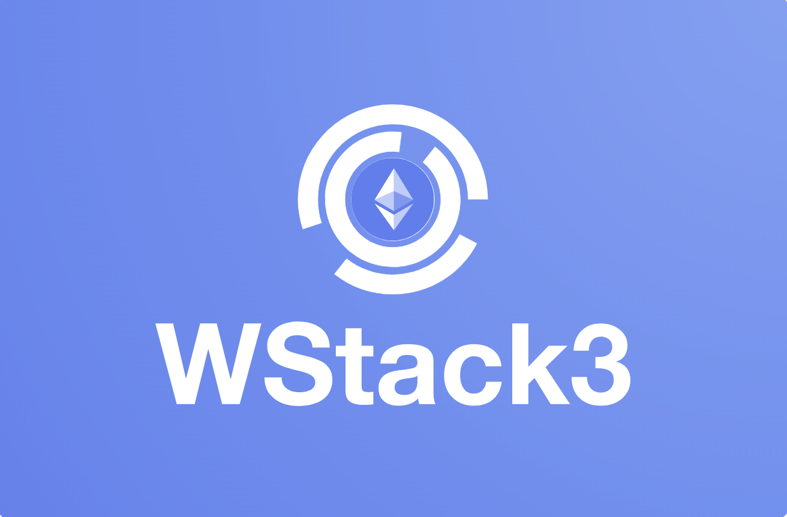

# 🔐 Secure Server-Optimized DeFi Web Application

A secure, high-performance DeFi web application built using **Laravel (PHP)**, **JavaScript**, **Web3**, and the **1inch API**. This project merges blockchain-based decentralized authentication with the scalability and control of a server-side architecture.

---

# Project Overview  
The goal is to develop a Web3 website using a **Server-Side API Proxy Architecture** that minimizes redundant API calls while preserving the full functionality expected from a typical Web3 site.

---

## How It Works  
- Instead of the frontend directly communicating with Web3 API endpoints, all requests first go through a secure backend proxy.  
- Security is enforced using **CSRF tokens** and **cross-origin protections**, ensuring that only legitimate requests are processed.  
- The backend serves as an intermediary layer that **aggregates, manages, and optimizes** incoming requests from users or other applications.  
- By consolidating these requests before forwarding them to the actual Web3 API, the system reduces duplicate calls, lowering latency and API usage costs.  
- Once the backend receives responses from the Web3 API, it distributes the relevant data back to each individual user.

---

## Benefits  
- **Improved efficiency** by reducing redundant calls to external Web3 APIs.  
- **Enhanced security** through centralized control and protection mechanisms.  
- **Better scalability** by managing API traffic more effectively.  
- **Seamless user experience** with the same functionalities as a direct Web3 site.

---

## 🚀 Key Features

### 1. Wallet-Based Authentication (No Passwords)
- Users log in by **signing a message** with their crypto wallet (e.g., MetaMask).
- No need for traditional credentials — frictionless login/registration via Web3.
- **Enhanced security** through decentralized identity verification (no password storage).

### 2. Real-Time DeFi Data & Interactions
- Live display of:
  - **Wallet balances**
  - **Gas fees**
  - **Supported blockchain networks**
- Integrated with the **1inch DEX API** for:
  - Token search
  - Token swap execution

### 3. Server-Side API Proxy Architecture
All third-party API interactions (e.g., 1inch) are securely routed through a Laravel backend to:
- Protect API keys
- Enforce **CSRF protection**
- Implement **CORS policies**
- Apply **rate limiting** and **request validation**

---

## ⚙️ Backend Optimizations

### Efficient API Request Handling
The backend functions as a proxy and caching layer:

#### 🔄 Cached Resources
- **Token Lists** – Cached for 20 hours
- **Token Prices** – Cached for 30 seconds

### ✅ Benefits
- Reduces redundant client-side API calls
- Minimizes external API load
- Improves app performance and scalability
- Centralized control over data freshness and consistency

---

## 🛡️ Security & Scalability

- API keys and sensitive data are kept **server-side only**
- Caching + request validation boosts performance **without sacrificing trust**
- **Session-less authentication** (via wallet signatures) minimizes attack surfaces

---

## 📐 System Architecture Diagram

```plaintext
[ Client (Browser) ]
       |
       | 1. Wallet Connect & Signature
       v
[ Web3.js / Ethers.js ]
       |
       | 2. Auth Signature → API
       v
[ Laravel Backend (API Layer) ]
       |    \
       |     \ 3. Proxy & Secure API Calls
       |      \
       |       v
[ Caching Layer]    [ 1inch API ]
       |                                    |
       |<---- Cached or Fresh Data ---------|

[ Database (Optional - For logs, settings, non-wallet info) ]
```

Requirements
------------
These services are required for normal operation:
* [php](https://secure.php.net/downloads.php) 8.2+
* [Composer](https://getcomposer.org/download/)
* OpenSSL PHP Extension
* PDO PHP Extension
* Mbstring PHP Extension
* Tokenizer PHP Extension
* XML PHP Extension
* Ctype PHP Extension
* JSON PHP Extension
* BCMath PHP Extension
* [mysql](https://www.mysql.com/downloads/) or compatible DBMS

## Setup

- git clone
- edit .env
- composer install
- php artisan migrate
- php artisan voyager:install --with-dummy
- php artisan voyager:admin admin@email.com --create
- php artisan storage:link
